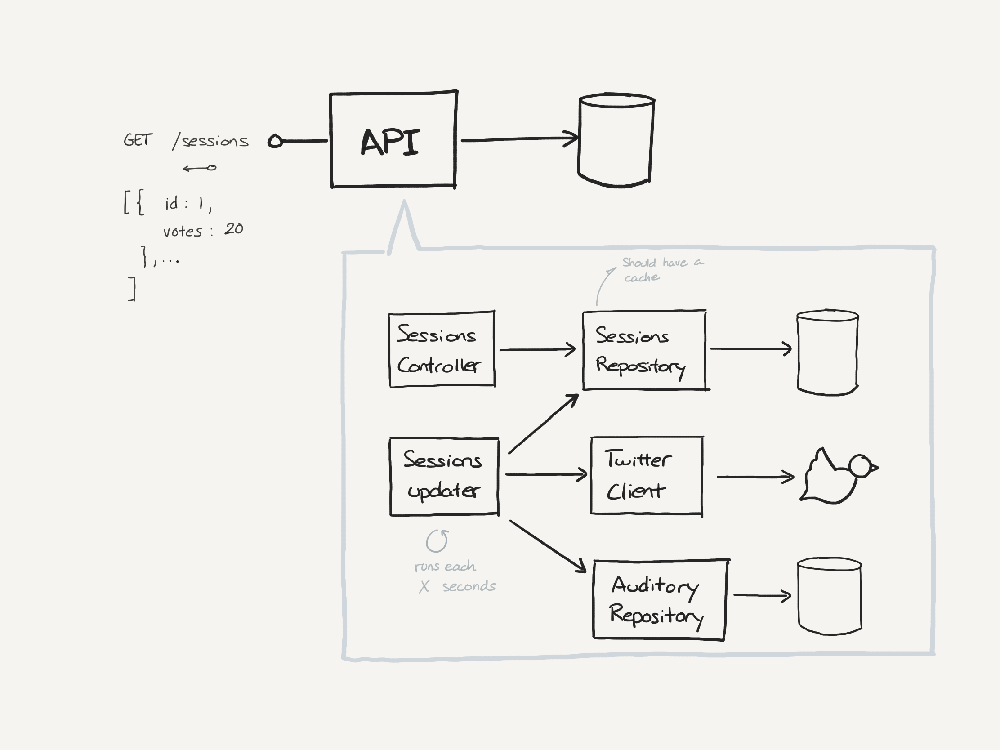

# Tarugoff services

[](https://travis-ci.org/ydarias/tarugoff-sessions)

This project exposes a REST API to support the votes at Tarugoff Sessions page. It also contain the code to update the data from Twitter API.




## First steps

Install dependencies and transpile TS into JS.

```shell script
npm install
```

Run the application.

```shell script
npm start
```

To run tests.

```shell script
npm test
```

### Testing and developing

There are some scripts with watchers that makes the development process more comfortable.

```shell script
npm test:watch
npm start:dev
```

Both commands watch for changes into the source code to rebuild the project and make the changes available.

### API documentation

The API is "documented" with Open API

```
http://localhost:3000/api
```

## Deployment

To deploy a new version from a local environment.

```shell script
git push heroku master
```